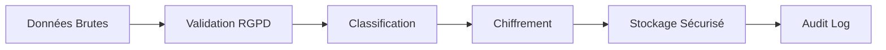

# Guide de Conformité RGPD - Aurore Finance

## 📋 Table des Matières

1. [Vue d'ensemble](#vue-densemble)
2. [Architecture de Sécurité](#architecture-de-sécurité)
3. [Procédures Opérationnelles](#procédures-opérationnelles)
4. [Droits des Utilisateurs](#droits-des-utilisateurs)
5. [Audit et Surveillance](#audit-et-surveillance)
6. [Gestion des Incidents](#gestion-des-incidents)
7. [Maintenance et Formation](#maintenance-et-formation)

---

## 🎯 Vue d'ensemble

### Objectif de Conformité

Aurore Finance met en œuvre une conformité complète au RGPD pour la gestion des données fiscales sensibles, incluant :

- **Chiffrement AES-256-GCM** de toutes les données personnelles
- **Anonymisation automatique** pour les interactions IA
- **Contrôle d'accès basé sur les rôles (RBAC)**
- **Audit complet** de tous les accès aux données
- **Gestion automatisée des droits** des utilisateurs (Articles 15-22)

### Principaux Composants

| Composant | Fonction | Conformité RGPD |
|-----------|----------|-----------------|
| **GDPREncryptionService** | Chiffrement des données sensibles | Art. 32 - Sécurité |
| **RBACService** | Contrôle d'accès granulaire | Art. 5 - Minimisation |
| **AuditLoggingService** | Journalisation complète | Art. 5 - Responsabilité |
| **AnonymizationService** | Protection pour IA/LLM | Art. 25 - Protection dès la conception |
| **KeyManagementService** | Rotation automatique des clés | Art. 32 - Sécurité |

---

## 🔐 Architecture de Sécurité

### Modèle de Classification des Données

```yaml
Niveaux de Sensibilité:
  public:           # Données publiques (canton, situation civile)
    encryption: false
    anonymization: false
    retention: "3 ans"
    
  internal:         # Données internes (préférences, métadonnées)
    encryption: false
    anonymization: true
    retention: "3 ans"
    
  confidential:     # Données confidentielles (adresse, téléphone)
    encryption: true
    anonymization: true
    retention: "7 ans"
    
  highly_sensitive: # Données hautement sensibles (nom, AVS, salaire)
    encryption: true
    anonymization: true
    retention: "7 ans"
    audit_required: true
```

### Chiffrement et Gestion des Clés

#### Configuration Standard
```typescript
SecurityConfig = {
  encryption: {
    algorithm: 'AES-256-GCM',
    keyDerivation: 'Argon2',
    saltLength: 32,
    ivLength: 12,
    tagLength: 16
  },
  keyManagement: {
    rotationInterval: 90, // jours
    provider: 'local', // ou 'aws-kms', 'azure-keyvault'
  }
}
```

#### Procédure de Rotation des Clés
1. **Génération automatique** tous les 90 jours
2. **Sauvegarde chiffrée** de l'ancienne clé
3. **Migration progressive** des données
4. **Validation d'intégrité** après rotation
5. **Audit complet** de l'opération

### Contrôle d'Accès (RBAC)

#### Rôles Prédéfinis

| Rôle | Niveau d'Accès | Permissions | Restrictions |
|------|----------------|-------------|--------------|
| **user** | confidential | Lecture/écriture de ses données | Champs système masqués |
| **ai_assistant** | internal | Lecture anonymisée uniquement | Données personnelles masquées |
| **fiscal_admin** | highly_sensitive | Accès complet avec audit | MFA requis |
| **gdpr_auditor** | internal | Lecture des logs d'audit | Données fiscales masquées |

#### Matrice des Permissions

```typescript
Permissions = {
  "user": [
    { action: "read", resource: "tax_profile.own", conditions: ["purpose=personal_use"] },
    { action: "write", resource: "tax_profile.own", conditions: ["consent_required"] },
    { action: "export", resource: "tax_profile.own", audit: true }
  ],
  "ai_assistant": [
    { action: "read", resource: "tax_profile.anonymized", conditions: ["purpose=ai_assistance"] }
  ]
}
```

---

## ⚙️ Procédures Opérationnelles

### 1. Collecte des Données (Article 5 - Minimisation)

#### Validation Automatique
```typescript
// Vérification avant collecte
function validateDataCollection(field: string, value: any, purpose: string) {
  const metadata = GDPR_TAX_SCHEMA[field];
  
  if (!metadata) throw new Error('Champ non autorisé');
  if (!isNecessaryForPurpose(field, purpose)) throw new Error('Non nécessaire');
  if (!hasLegalBasis(metadata.legalBasis)) throw new Error('Base légale manquante');
  
  return true;
}
```

#### Checklist de Collecte
- [ ] **Base légale identifiée** (consentement, obligation légale, etc.)
- [ ] **Finalité claire et limitée**
- [ ] **Données minimales nécessaires**
- [ ] **Période de rétention définie**
- [ ] **Consentement enregistré** (si applicable)

### 2. Traitement et Stockage

#### Pipeline de Sécurisation


#### Procédure de Chiffrement
```bash
# 1. Classification automatique
classify_data(input_data) -> sensitivity_level

# 2. Chiffrement selon le niveau
if sensitivity_level >= "confidential":
    encrypted_data = encrypt_with_AES256_GCM(input_data)
    
# 3. Stockage avec métadonnées
store_with_metadata(encrypted_data, {
    sensitivity: sensitivity_level,
    purpose: processing_purpose,
    retention_until: calculate_retention_date(),
    legal_basis: legal_justification
})
```

### 3. Interactions avec l'IA (Anonymisation)

#### Processus d'Anonymisation
```typescript
// Avant envoi à OpenAI/LLM
async function prepareForLLM(taxProfile: TaxProfile, userMessage: string) {
  // 1. Anonymisation du profil
  const anonymized = await GDPRAnonymizationService.anonymizeForLLM(
    taxProfile, 
    'AI_ASSISTANCE', 
    userId
  );
  
  // 2. Nettoyage du message utilisateur
  const sanitizedMessage = await sanitizeUserMessage(userMessage);
  
  // 3. Création du contexte sécurisé
  const context = createSecureContext(anonymized.anonymizedContent);
  
  return { sanitizedMessage, context, sessionId: anonymized.context.sessionId };
}

// Après réponse du LLM
async function processLLMResponse(response: string, sessionId: string) {
  // Restauration des données réelles
  return await GDPRAnonymizationService.deanonymizeContent(response, sessionId);
}
```

#### Patterns d'Anonymisation
| Type de Donnée | Pattern Original | Pattern Anonymisé |
|----------------|------------------|-------------------|
| Nom | Jean Dupont | `<<NOM_A1B2C3>>` |
| AVS | 756.1234.5678.90 | `<<ID_D4E5F6>>` |
| Salaire | 85000 CHF | `<<MONTANT_G7H8I9>>` |
| Email | jean@email.com | `<<CONTACT_J1K2L3>>` |

---

## 👤 Droits des Utilisateurs

### Article 15 - Droit d'Accès

#### API: `POST /api/gdpr/access`

**Paramètres :**
```json
{
  "userId": "user-uuid",
  "format": "json|pdf|csv",
  "categories": ["personal", "financial", "preferences"],
  "purpose": "gdpr_access_request"
}
```

**Réponse Conforme :**
- ✅ **Toutes les données** détenues sur l'utilisateur
- ✅ **Finalités du traitement** clairement expliquées
- ✅ **Base légale** pour chaque catégorie
- ✅ **Période de rétention** pour chaque type
- ✅ **Droits restants** (rectification, effacement, etc.)

#### Délai de Réponse
- **Standard :** 30 jours maximum
- **Complexe :** 90 jours avec justification
- **Notification automatique** des délais

### Article 16 - Droit de Rectification

#### API: `POST /api/gdpr/rectification`

**Validation Automatique :**
```typescript
const validationRules = {
  'personalInfo.email': emailRegex,
  'personalInfo.phone': phoneRegex,
  'personalInfo.canton': validCantons,
  'incomeData.grossSalary': (val) => val >= 0 && val <= 10000000
};
```

**Champs Modifiables :**
- ✅ Informations de contact (email, téléphone)
- ✅ Préférences utilisateur
- ✅ Données non-critiques
- ❌ Numéro AVS (validation administrative requise)
- ❌ Données déjà validées par des tiers

#### Audit de Rectification
Chaque modification génère :
- **Log d'audit détaillé** (avant/après)
- **Notification utilisateur** pour changements critiques
- **Traçabilité complète** des modifications

### Article 17 - Droit à l'Effacement

#### API: `POST /api/gdpr/erasure`

**Évaluation Automatique :**
```typescript
async function assessErasureFeasibility(userId: string, reason: ErasureReason) {
  const legalObligations = [
    {
      category: 'tax_data',
      requirement: 'Conservation 7 ans (Code des obligations CO 957a)',
      blocking: true,
      expiryDate: calculateTaxRetentionExpiry(userId)
    }
  ];
  
  return {
    canErase: legalObligations.every(lo => !lo.blocking),
    blockedCategories: legalObligations.filter(lo => lo.blocking),
    alternatives: ['restriction', 'objection', 'anonymization']
  };
}
```

**Effacement Partiel :**
- ✅ **Données marketing** (immédiat)
- ✅ **Préférences** (immédiat)
- ✅ **Données analytiques** (immédiat)
- ⏳ **Données fiscales** (après 7 ans)
- ⏳ **Logs d'audit** (après 7 ans)

#### Certificat d'Effacement
```json
{
  "certificateId": "cert_1729123456_ABC123",
  "completionStatus": "partial",
  "deletedData": {
    "categories": ["preferences", "marketing"],
    "recordCount": 23
  },
  "retainedData": {
    "categories": ["tax_data"],
    "legalBasis": "Article 17.3 - Obligation légale",
    "retentionPeriod": "7 ans"
  },
  "verificationHash": "a1b2c3d4e5f6g7h8"
}
```

### Article 20 - Droit à la Portabilité

#### API: `POST /api/gdpr/portability`

**Formats Supportés :**
- **JSON** : Structure complète avec métadonnées
- **XML** : Format eCH compatible
- **CSV** : Import facile dans d'autres systèmes

**Structure d'Export :**
```json
{
  "metadata": {
    "exportDate": "2024-09-26T10:00:00Z",
    "standard": "GDPR Article 20",
    "version": "1.0"
  },
  "personalData": { /* données personnelles */ },
  "financialData": { /* données fiscales */ },
  "preferences": { /* préférences utilisateur */ },
  "processingHistory": { /* historique des traitements */ }
}
```

---

## 📊 Audit et Surveillance

### Journalisation Automatique

#### Événements Auditables
```typescript
type AuditAction = 
  | 'data_access' | 'data_modify' | 'data_delete' | 'data_export'
  | 'encryption' | 'decryption' | 'anonymization'
  | 'consent_given' | 'consent_withdrawn'
  | 'gdpr_request' | 'security_incident'
  | 'key_rotation' | 'role_assigned';
```

#### Structure de Log
```json
{
  "id": "audit_1729123456_abc123",
  "timestamp": "2024-09-26T10:00:00Z",
  "userId": "user-uuid",
  "action": "data_access",
  "resource": "tax_profile",
  "dataFields": ["personalInfo.firstName", "incomeData.salary"],
  "purpose": "tax_calculation",
  "legalBasis": "legal_obligation",
  "result": "success",
  "sensitivityLevel": "highly_sensitive",
  "ipAddress": "192.168.1.100",
  "userAgent": "Mozilla/5.0...",
  "duration": 150,
  "metadata": { /* détails spécifiques */ }
}
```

### Détection d'Incidents

#### Règles Automatiques
```yaml
Security Rules:
  - name: "Tentatives d'accès répétées"
    condition: "5+ échecs en 5 minutes"
    action: "Bloquer IP + Alerte admin"
    
  - name: "Accès hors horaires"
    condition: "Données sensibles entre 22h-6h"
    action: "Alerte de sécurité"
    
  - name: "Volume anormal"
    condition: ">1000 enregistrements exportés"
    action: "Validation manuelle requise"
    
  - name: "Géolocalisation suspecte"
    condition: "Accès depuis nouveau pays"
    action: "MFA supplémentaire"
```

### Reporting de Conformité

#### Dashboard en Temps Réel
- **Événements par jour/semaine/mois**
- **Répartition par niveau de sensibilité**
- **Taux de succès/échec des accès**
- **Demandes RGPD en cours**
- **Incidents de sécurité**

#### Métriques Clés
```sql
-- Conformité globale (objectif: >95%)
SELECT 
  COUNT(*) FILTER (WHERE result = 'success') * 100.0 / COUNT(*) as compliance_rate
FROM gdpr_audit_logs 
WHERE timestamp >= NOW() - INTERVAL '30 days';

-- Temps de réponse moyen aux demandes RGPD (objectif: <15 jours)
SELECT 
  AVG(EXTRACT(DAY FROM (completion_date - request_date))) as avg_response_days
FROM gdpr_requests 
WHERE status = 'completed';
```

---

## 🚨 Gestion des Incidents

### Classification des Incidents

| Niveau | Critères | Délai de Notification | Actions |
|--------|----------|----------------------|---------|
| **Faible** | <10 utilisateurs affectés | Pas d'obligation | Log interne |
| **Moyen** | 10-100 utilisateurs | 72h aux autorités | Notification utilisateurs |
| **Élevé** | >100 utilisateurs ou données sensibles | 72h aux autorités | Communication publique |
| **Critique** | Violation massive ou systémique | 24h aux autorités | Arrêt des services |

### Procédure d'Incident

#### 1. Détection et Évaluation
```typescript
async function handleSecurityIncident(incident: SecurityIncident) {
  // 1. Classification automatique
  const severity = classifyIncident(incident);
  
  // 2. Confinement immédiat
  if (severity >= 'high') {
    await containThreat(incident.source);
  }
  
  // 3. Notification des parties prenantes
  await notifyStakeholders(incident, severity);
  
  // 4. Investigation
  const investigation = await startInvestigation(incident);
  
  return { severity, investigation };
}
```

#### 2. Notification Réglementaire

**Autorités Compétentes :**
- **Suisse :** Préposé fédéral à la protection des données (PFPDT)
- **UE :** Autorité de protection des données du pays concerné

**Contenu de Notification :**
```json
{
  "incidentId": "breach_20241026_001",
  "timestamp": "2024-10-26T14:30:00Z",
  "severity": "high",
  "affectedPersons": 150,
  "dataCategories": ["personal_identification", "financial_data"],
  "cause": "unauthorized_access",
  "containmentActions": [
    "Revoked compromised access tokens",
    "Reinforced authentication",
    "Isolated affected systems"
  ],
  "riskAssessment": "Medium risk to individuals",
  "mitigationMeasures": [
    "Password reset for all affected users",
    "Additional monitoring",
    "Security audit"
  ]
}
```

#### 3. Communication Utilisateurs

**Template de Notification :**
```
Objet: Important - Incident de sécurité concernant vos données

Cher utilisateur,

Nous vous informons qu'un incident de sécurité s'est produit le [DATE] concernant 
potentiellement vos données personnelles sur Aurore Finance.

Données concernées: [LISTE]
Cause: [CAUSE SIMPLIFIÉE]
Actions prises: [MESURES DE SÉCURITÉ]

Recommandations:
- Changez votre mot de passe
- Surveillez vos comptes
- Contactez-nous pour toute question

Nous nous excusons pour cet incident et renforçons notre sécurité.

L'équipe Aurore Finance
contact@aurore-finance.com
```

---

## 🛠️ Maintenance et Formation

### Maintenance Préventive

#### Calendrier d'Opérations
```yaml
Quotidien:
  - Sauvegarde chiffrée des données
  - Vérification des logs de sécurité
  - Monitoring des performances

Hebdomadaire:
  - Révision des accès utilisateurs
  - Test des procédures de restauration
  - Mise à jour des règles de détection

Mensuel:
  - Audit des permissions
  - Test de pénétration interne
  - Formation continue du personnel

Trimestriel:
  - Rotation des clés de chiffrement
  - Audit externe de sécurité
  - Révision des politiques RGPD

Annuel:
  - Certification de conformité
  - Audit complet par un tiers
  - Mise à jour majeure des procédures
```

### Formation du Personnel

#### Modules Obligatoires
1. **Fondamentaux RGPD** (4h)
   - Principes de base
   - Droits des utilisateurs
   - Obligations légales

2. **Sécurité Technique** (6h)
   - Chiffrement et clés
   - Détection d'incidents
   - Procédures d'urgence

3. **Gestion des Incidents** (2h)
   - Classification
   - Procédures de notification
   - Communication de crise

#### Certification Continue
- **Test mensuel** de connaissances
- **Simulation d'incidents** trimestrielle
- **Mise à jour réglementaire** continue

### Documentation Technique

#### Guides Opérationnels
- 📚 **Guide d'Installation** : Déploiement des services de sécurité
- 🔧 **Guide de Configuration** : Paramétrage des politiques RGPD
- 🆘 **Guide d'Urgence** : Procédures en cas d'incident
- 📋 **Guide d'Audit** : Contrôles de conformité périodiques

#### Procédures Techniques
```bash
# Rotation manuelle des clés (urgence)
curl -X POST /api/admin/key-rotation \
  -H "Authorization: Bearer $ADMIN_TOKEN" \
  -H "X-Emergency: true"

# Vérification de l'intégrité des données
npm run gdpr:verify-integrity --user-id=$USER_ID

# Export d'audit pour les autorités
npm run gdpr:export-audit --from=2024-01-01 --to=2024-12-31

# Test de conformité complet
npm run test:gdpr-compliance
```

---

## 📞 Contacts et Support

### Équipe RGPD
- **DPO (Data Protection Officer) :** dpo@aurore-finance.com
- **Équipe Sécurité :** security@aurore-finance.com
- **Support Technique :** support@aurore-finance.com

### Autorités de Contrôle
- **Suisse :** Préposé fédéral à la protection des données (PFPDT)
  - Web: https://www.edoeb.admin.ch
  - Email: contact@edoeb.admin.ch

### Ressources Externes
- **Commission Européenne :** https://ec.europa.eu/info/law/law-topic/data-protection_fr
- **CNIL (France) :** https://www.cnil.fr
- **ICO (UK) :** https://ico.org.uk

---

## 🔄 Historique des Versions

| Version | Date | Modifications |
|---------|------|---------------|
| 1.0 | 2024-09-26 | Version initiale complète |
| 1.1 | 2024-10-01 | Ajout procédures d'incident |
| 1.2 | 2024-10-15 | Mise à jour API RGPD |

---

## ✅ Checklist de Conformité

### Conformité Technique
- [x] Chiffrement AES-256-GCM pour données sensibles
- [x] Anonymisation automatique pour IA/LLM
- [x] Contrôle d'accès basé sur les rôles (RBAC)
- [x] Journalisation complète des accès
- [x] Rotation automatique des clés de chiffrement
- [x] API pour tous les droits RGPD (Articles 15-22)
- [x] Détection automatique d'incidents de sécurité
- [x] Sauvegarde et restauration sécurisées

### Conformité Organisationnelle
- [x] Politique de confidentialité mise à jour
- [x] Procédures de notification d'incident (72h)
- [x] Formation du personnel aux enjeux RGPD
- [x] Désignation d'un DPO (Data Protection Officer)
- [x] Registre des traitements à jour
- [x] Analyse d'impact sur la protection des données (AIPD)
- [x] Contrats avec les sous-traitants conformes
- [x] Procédures de gestion des demandes utilisateurs

### Conformité Légale
- [x] Base légale identifiée pour chaque traitement
- [x] Finalités claires et limitées
- [x] Minimisation des données collectées
- [x] Périodes de rétention définies et respectées
- [x] Consentement libre et éclairé (si applicable)
- [x] Information claire des utilisateurs
- [x] Facilitation de l'exercice des droits
- [x] Transferts internationaux sécurisés (si applicable)

---

*Ce guide est mis à jour régulièrement pour refléter les évolutions réglementaires et les meilleures pratiques en matière de protection des données.*